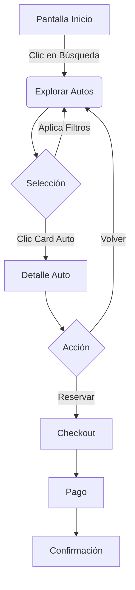
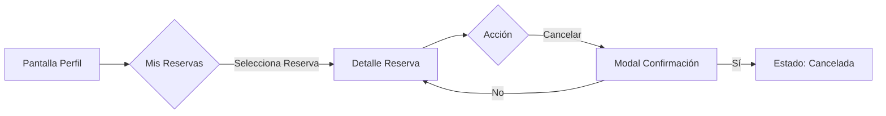
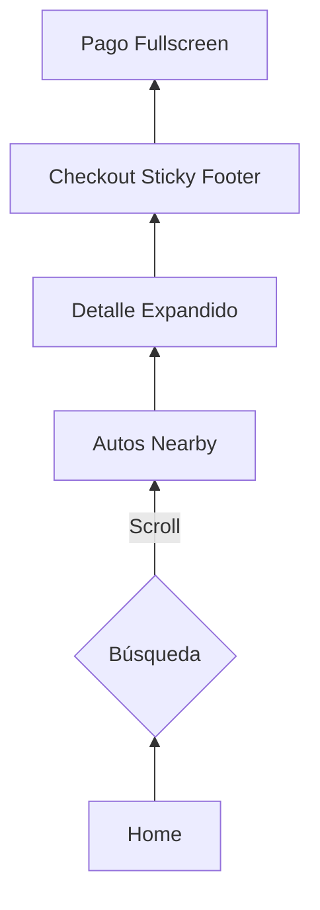

# Capítulo IV: Diseño del Producto

## 4.1. Guías de Estilo

### 4.1.1. Guías de Estilo Generales

**Tipografía**

**Fuente Principal:** Poppins

**Pesos de Fuente:**

- Light (300): Textos secundarios y descripciones  
- Regular (400): Texto principal y contenido  
- Medium (500): Subtítulos y elementos interactivos  
- Semibold (600): Títulos de secciones  
- Bold (700): Títulos principales y elementos destacados  

**Jerarquía Tipográfica:**

- H1: 48px/60px (móvil), 64px/76px (escritorio)  
- H2: 36px/44px (móvil), 48px/56px (escritorio)  
- H3: 24px/32px (móvil), 32px/40px (escritorio)  
- Cuerpo: 16px/24px  
- Texto pequeño: 14px/20px  

**Paleta de Colores**

**Colores Principales:**

- Azul Eléctrico (#006AFF)  
  **Uso:** Botones principales, enlaces, íconos destacados  

**Variaciones:**

- 50: #eaf2ff  
- 100: #cce2ff  
- 200: #99c4ff  
- 300: #66a6ff  
- 400: #3388ff  
- 500: #006aff  
- 600: #005ce0  
- 700: #004dbf  
- 800: #003f9f  
- 900: #003080  

**Modo Claro:**

- Fondo Principal: Blanco (#FFFFFF)  
- Texto Principal: Negro (#1C1C25)  
- Texto Secundario: Gris (#666666)  

**Modo Oscuro:**

- Fondo Principal: Negro (#1C1C25)  
- Texto Principal: Blanco (#FFFFFF)  
- Texto Secundario: Gris Claro (#CCCCCC)  

**Sistema de Espaciado**

**Unidad Base:** 4px  

**Escala:**

- xs: 4px  
- sm: 8px  
- md: 16px  
- lg: 24px  
- xl: 32px  
- 2xl: 48px  
- 3xl: 64px  
- 4xl: 96px  

**Bordes y Sombras**

**Radios de Borde:**

- Pequeño: 12px  
- Mediano: 16px  
- Grande: 24px  

**Sistema de Sombras:**

```css
--shadow-sm: 0 2px 4px rgba(0,0,0,0.1);
--shadow-md: 0 4px 8px rgba(0,0,0,0.12);
--shadow-lg: 0 8px 16px rgba(0,0,0,0.15);
```

### 4.1.2. Guías de Estilo Web

### Componentes UI

**Botones:**

```css
.btn-primary {
  background: var(--color-primary-500);
  color: white;
  padding: 12px 24px;
  border-radius: 12px;
  font-weight: 500;
  transition: all 0.3s;
}

.btn-secondary {
  background: transparent;
  border: 2px solid var(--color-primary-500);
  color: var(--color-primary-500);
}
```

### Sistema de Grid

**Contenedor:**

- Máximo: 1280px  
- Padding: 24px (móvil), 32px (escritorio)  

**Columnas:**

- Móvil: 4 columnas  
- Tablet: 8 columnas  
- Escritorio: 12 columnas

**Gutters:**
- Móvil: 16px
- Escritorio: 24px

### Estados Interactivos

#### Hover:
- **Botones:** Oscurecimiento 10%
- **Enlaces:** Subrayado
- **Tarjetas:** Elevación aumentada

#### Focus:
- **Anillo de focus visible**
  - Color: `#006AFF`
  - Grosor: `2px`
  - Offset: `2px`

### Animaciones

#### Transiciones:
- **Duración:** `300ms`
- **Timing:** `ease-in-out`

#### Hover:

```css
.hover-transform {
  transition: transform 0.3s;
}
.hover-transform:hover {
  transform: translateY(-4px);
}
``` 

## 4.2. Arquitectura de la Información

### 4.2.1. Sistemas de Organización

**Estructura de Contenido**

```
├── Inicio (Hero)
├── Beneficios
│   ├── Flota Premium
│   ├── Reservas Flexibles
│   ├── Proceso Sencillo
│   └── Servicio 24/7
├── Flota de Vehículos
│   ├── Económicos
│   ├── SUVs
│   ├── Lujo
│   └── Vans
├── Proceso de Alquiler
├── Requisitos
├── Testimonios
├── Preguntas Frecuentes
└── Contacto
```

### 4.2.2. Sistemas de Etiquetado

**Navegación Principal**

- Inicio  
- Vehículos  
- ¿Cómo Funciona?  
- Requisitos  
- Preguntas Frecuentes  
- Contacto

**Llamadas a la Acción**

- **Principales:** 
  - "Reservar ahora"
  - "Explorar vehículos"

- **Secundarias:**
  - "Conoce más"
  - "Ver requisitos"

**Etiquetas de Categorías**

- **Vehículos:**
  - "Económico"
  - "SUV"
  - "Lujo"
  - "Van"
  
- **Características:**
  - "A/C"
  - "Automático"
  - "GPS"
  - "Asientos de cuero"  

### 4.2.3. SEO y Meta Tags

```html
<title>AutoElite | Alquiler de Vehículos Premium en Perú</title>
<meta name="description" content="Alquila vehículos de alta gama en Perú con AutoElite. Flota moderna, proceso sencillo y atención personalizada 24/7. ¡Reserva ahora!">
<meta name="keywords" content="alquiler de autos perú, rent a car lima, alquiler de vehículos premium, autoelite perú">
<meta name="robots" content="index, follow">
<meta name="language" content="es">
```

#### 4.2.4. Sistemas de Búsqueda

**Filtros Principales**

- **Tipo de Vehículo**
  - Checkbox múltiple
  - Actualización instantánea
- **Rango de Precios**
  - Slider dual
  - Valores: S/50 - S/500
- **Características**
  - Transmisión
  - Número de pasajeros
  - Equipamiento

**Búsqueda por Ubicación**

- Integración con Google Places
- Autocompletado de direcciones
- Radio de búsqueda personalizable

#### 4.2.5. Sistemas de Navegación

**Navegación Principal**

- Menú fijo en header
- Responsive dropdown en móvil
- Indicador de sección actual

**Navegación Secundaria**

- Footer estructurado
- Enlaces rápidos
- Mapa del sitio

**Navegación Contextual**

- Breadcrumbs en secciones profundas
- Enlaces relacionados
- "Volver arriba" flotante 

## 4.3. Diseño UI de Landing Page

### 4.3.1. Wireframe de Landing Page

**Hero Section**

- Banner principal con imagen de fondo  
- Título principal y subtítulo  
- CTA primario y secundario  
- Estadísticas clave  

**Sección de Beneficios**

- Grid de 4 beneficios principales  
- Iconos ilustrativos  
- Descripciones concisas  

**Flota de Vehículos**

- Filtros de categoría  
- Grid de vehículos  
- Tarjetas con:  
  - Imagen del vehículo  
  - Nombre y categoría  
  - Características principales  
  - Precio por día  
  - Botón de reserva  

### 4.3.2. Mock-up de Landing Page

**Elementos UI**

- Navbar con modo oscuro/claro  
- Hero section con overlay gradiente  
- Tarjetas con sombras y hover  
- Formulario de contacto  
- Footer con newsletter  

**Interacciones**

- Animaciones suaves  
- Estados hover  
- Transiciones de modo oscuro  
- Menú móvil responsive

## 4.4. Web Applications UX/UI Design.
### 4.4.1. Web Applications Wireframes
#### **1. Cabecera (Header)** 
**Objetivo**: Brindar acceso rápido a funciones principales y mantener al usuario orientado.  

- **Logo (Superior izquierda)**:  
  - Enlace a la página de inicio.  
  - Estilo consistente.
- **Menú de navegación**:  
  - **Desktop**: Tabs horizontales (`Inicio | Vehículos | ¿Cómo funciona? | Requisitos | Preguntas | Contacto`).  
  - **Mobile**: Menú hamburguesa (íconos + texto).  

---
#### **2. Cuerpo (Main Content)**  
**Objetivo**: Mostrar opciones de autos de forma clara y accionable. 
- **Tipo de auto
  "Encuentra el auto perfecto para tu viaje"
🚗 Ciudad  🏔️ Aventura  💼 Negocios  🏖️ Vacaciones
```card
[🖼️ Jeep Wrangler 2024]  🔥 Popular
★★★★☆ (128)  |  $120/día
👥5  🛄4  🛣️4x4  ⛽Eléctrico
[🔵 Reservar ahora]
```
---

#### **3. Footer**  
**Objetivo**: Proporcionar información secundaria y enlaces útiles.  
- **Sección 2 columnas**:  
  - **Encima**:  
    - Información de RentGo.  
    - Redes sociales: `FB | Instagram | X | Youtube`.    
  - **Debajo**:  
    - Enlaces rápidos (`Empresa | Servicios | Información`).
    - Boletin informativo: Campo `"Correo"` + Botón `"Suscribir"`.
- **Derechos de autor**:  
  - `"© 2024 AutoElite. Todos los derechos reservados."` (centrado).
  
### 4.4.2. Web Applications Wireflow Diagrams
### Flujo Principal: Reserva de Auto

### Flujo Alternativo: Cancelación

### Flujo Mobile

### 4.4.2. Web Applications Mock-ups.
**Propósito**: Punto de entrada para exploración de autos  

*Version Desktop:*


---

*Version Mobile:*


