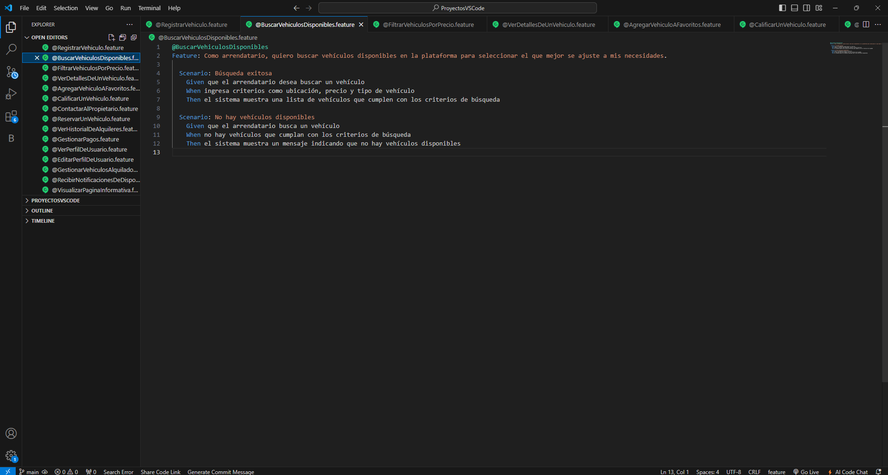
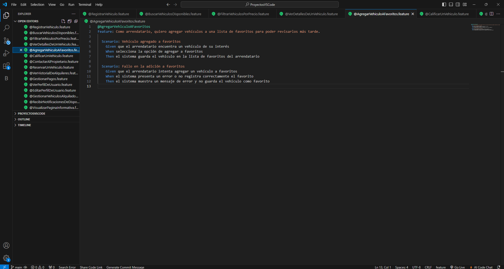
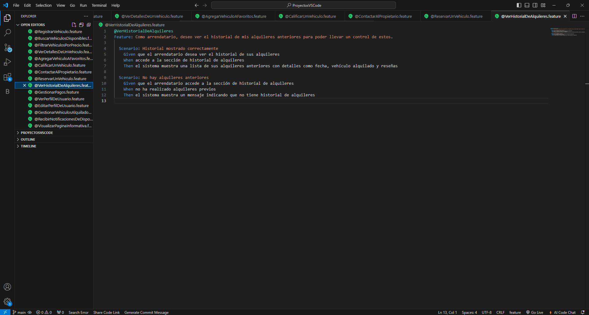

# Capítulo V: Product Implementation, Validation & Deployment

## 5.1. Software Configuration Management

Esta guía define las decisiones y acuerdos fundamentales para el desarrollo, mantenimiento y despliegue de la aplicación **Rent2Go**, que gestiona el alquiler de vehículos. El objetivo es asegurar la coherencia, eficiencia y calidad a lo largo del ciclo de vida del proyecto.

### 5.1.1. Software Development Environment Configuration

<table border="1">

  <tr>
    <td>Project Management</td>
    <td>Microsoft 365 Alojamiento de los videos de entrevistas, explicación de prototipos y otros relacionados al proyecto</td>
  </tr>
  <tr>
    <td></td>
    <td>Whatsapp Red Social destinada a la comunicación donde se realizaron acuerdos y recordatorios de las reuniones.</td>
  </tr>
  <tr>
    <td></td>
    <td>Trello Software de administración y gestión de proyectos que se utilizó para establecer y designar las tareas</td>
  </tr>
  <tr>
    <td>Requirements Management</td>
    <td>Structurizr Structurizr es una herramienta de modelado y documentación que permitió el desarrollo de los diagramas C4</td>
  </tr>
  <tr>
    <td></td>
    <td>LucidChart Herramienta de diseño para el modelado de diagramas UML.</td>
  </tr>
  <tr>
    <td></td>
    <td>Miro Herramienta de diseño para la creación de los As-Is y To-Be Scenario Mapping</td>
  </tr>
  <tr>
    <td>Product UX/UI Design</td>
    <td>Figma Herramienta que se utilizó para la creación de wireframes, mockups y prototipos.</td>
  </tr>
  <tr>
    <td>Software Development</td>
    <td>Git Es un software de control de versiones para los trabajos en equipos y confiabilidad del desarrollo.</td>
  </tr>
  <tr>
    <td></td>
    <td>Node.js Node.js es un entorno de ejecución de JavaScript del lado del servidor, que permite desarrollar aplicaciones web escalables y de alto rendimiento fuera del navegador.</td>
  </tr>
  <tr>
    <td></td>
    <td>GitHub Sistema de control de versiones Git.</td>
  </tr>
  <tr>
    <td></td>
    <td>HTML5 Lenguaje de etiquetas, utilizado para la estructuración y la presentación de contenido.</td>
  </tr>
  <tr>
    <td></td>
    <td>CSS CSS es un lenguaje utilizado para estilizar y dar formato a documentos HTML.</td>
  </tr>
  <tr>
    <td></td>
    <td>JavaScript JavaScript es un lenguaje de programación de alto nivel, interpretado y multi-paradigma, utilizado para crear interactividad en páginas web.</td>
  </tr>
  <tr>
    <td></td>
    <td>VScode Es un editor de código fuente con extensiones que ayudan al desarrollo.</td>
  </tr>
    <tr>
    <td></td>
    <td>WebStorm Es un IDE centrado en el desarrollo frontend, por su variedad de herramientas que agilizan el proceso de desarrollo.</td>
  </tr>
  <tr>
    <td></td>
    <td>Vue.js Framework Framework basado en Single Page Applications para el desarrollo de frontend</td>
  </tr>
  <tr>
    <td>Software Deployment</td>
    <td>GitHub Pages Plataforma que nos permite realizar el despliegue de nuestro landing page.</td>
  </tr>
</table>

### 5.1.2. Source Code Management

Para "**Rent2Go**", utilizaremos el enfoque Gitflow con GitHub para gestionar el desarrollo del proyecto, con la finalidad de implementar correctamente el proyecto con la elaboración del reporte.

GitHub facilitará la colaboración en equipo mediante pull requests para revisar y aprobar cambios, y issues para gestionar tareas y errores. Además, GitHub Pages permitirá la visualización de una versión de ejemplo de la aplicación. Esta estructura garantiza un desarrollo organizado, seguimiento efectivo del progreso y una integración continua de cambios, mejorando la eficiencia y calidad del proyecto.

URL del repositorio del Report en GitHub: [https://github.com/1ASI0730-2510-4381-G5-RENT2GO/Grupo5-report](https://github.com/1ASI0730-2510-4381-G5-RENT2GO/Grupo5-report)

URL del repositorio del Landing Page en GitHub: [https://github.com/1ASI0730-2510-4381-G5-RENT2GO/landing-page](https://github.com/1ASI0730-2510-4381-G5-RENT2GO/landing-page)
### 5.1.3. Source Code Style Guide & Conventions

Para "**Rent2Go**", implementaremos una guía de estilo de código y convenciones utilizando HTML y CSS, buscando implementar una interfaz sencilla e interactica.

**HTML**: Lenguaje que hemos utilizado para el desarrollo de nuestra Landing Page. Este lenguaje utiliza etiquetas para marcar y definir el contenido de la página web. Como textos, imagenes, videos, etc.

Convenciones:

- Se tiene que declarar el tipo de archivo en la primera fila de cada documento ("Doctype HTML o Styles CSS").
- Las etiquetas deben de mostrarse en minuscula, ya que es más sencillo identificar y por ende, será más sencillo detectar los contenidos para los desarrolladores.

**CSS**: Lenguaje que se vincula a un proyecto, en este caso, proyecyto html, que nos permite dar estilos a los elementos html. Con este lenguaje se pueden crear diseños web agradables e intuitivos para el usuario, que es lo que buscamos lograr en nuestra Landing Page.

### 5.1.4. Software Deployment Configuration

Para el despliegue de nuestra Landing Page, usamos las siguientes herramientas.

- **Git**: Para realizar el manejo de las versiones del proyecto.
- **GitHub**: Dentro de la plataforma tenemos un repositorio, lo usamos para almacenar todo el proyecto con sus respectivas versiones.
- **GitFlow**: Esto permite visualizar y controlar el flujo de trabajo hecho por el equipo de desarrollo.
- **GitHub Pages**: Nos permite desplegar nuestra Landing Page bajo el dominio de "[github.io](https://pages.github.com/)".

Esto nos permite mantener el código organizado, legible y coherente a lo largo del proyecto.

- US01:

- US02:

- US03:

- US04:

- US05:

- US06:

- US07:

- US08:

- US09:

- US010:

- US11:

- US12:

- US13:

- US014:

- US15:

## 5.2. Landing Page, Services & Applications Implementation

### 5.2.1. Sprint 1

#### 5.2.1.1. Sprint Planning 1

<table align="center"  border="1" width="90%" style="text-align:center;">
    <tr align="left">
        <td>
            <b>Sprint #</b>
        </td>
        <td>
            <b>Sprint 1</b>           
        </td>
    </tr>
    <tr align="left">
        <td colspan="2">
            <b>Sprint Planning Background</b>
        </td>
    </tr>
    <tr align="left">
        <td>
            <b>Date</b>
        </td>
        <td>
            25/04/25   
        </td>
    </tr>
       <tr align="left">
        <td>
            <b>Time</b>
        </td>
        <td>
            10:00         
        </td>
    </tr>
       <tr align="left">
        <td>
            <b>Location</b>
        </td>
        <td>
            Modalidad Remota por Whatsapp  
        </td>
    </tr>
     </tr>
       <tr align="left">
        <td>
            <b>Prepared By</b>
        </td>
        <td>
            Integrantes 4Logicz  
        </td>
    </tr>
    </tr>
       <tr align="left">
        <td>
            <b>Attendess (to planning meeting)</b>
        </td>
        <td>
            - Chavez Uribe, Ario Joel	 
            - Alvarez Ponce, Carlos Antonio  
            - Aru Acevedo, Yair Christofer  
            - Gonzalez Custodio, Carlos Alberto  
            - Salhuana Lopez, Fernando Jose  
        </td>
    </tr>
    </tr>
       <tr align="left">
        <td>
            <b>Sprint n - 1</b>
            <b>Review Summary</b>
        </td>
        <td>
            No existe un sprint anterior para realizar el review, siendo este el primer sprint a desarrollar.  
        </td>
    </tr>
    <tr align="left">
        <td>
            <b>Sprint n - 1</b>
            <b>Retrospective Summary</b>
        </td>
        <td>
          No existe un sprint anterior para realizar una retrospectiva. Sin embargo en base a lo avanzado debemos considerar prioridad en el buen desarrollo de las User Stories y el Product Backlog.
        </td>
    </tr>
    <tr align="left">
        <td colspan="2">
            <b>Sprint Goal & User Stories</b>
        </td>
    </tr>
      <tr align="left">
        <td>
            <b>Sprint 1 Velocity</b>
        </td>
        <td>
            6
        </td>
    </tr>
       <tr align="left">
        <td>
            <b>Sum of Story Points</b>
        </td>
        <td>
            6
        </td>
  </tr>
</table>

#### 5.2.1.2. Sprint Backlog 1

 

<table align="center" border="1" width="90%" style="text-align:center">
    <tr>
       <td colspan="1"><b>Sprint #</b></td>
       <td colspan="7"><b>Sprint 1</b></td>
     </tr>
     <tr>
       <td colspan="2"><b>User Story</b></td>
       <td colspan="6"><b>Work-Item / Task</b></td>
     </tr>
     <tr>
       <td><b>Id</b></td>
       <td><b>Title</b></td>
       <td><b>Id</b></td>
       <td><b>Title</b></td>
       <td><b>Description</b></td>
       <td><b>Estimation(Hours)</b></td>
       <td><b>Assigned To</b></td>
       <td><b>Status(To-do/ In-Process/ To-Review/ Done)</b></td>
     </tr>
     <tr>
       <td rowspan="2">HU15</td>
       <td rowspan="2">Visualizar página informativa</td>
       <td>T01</td>
       <td>Estructura de la landing</td>
       <td>Programar el landing page comenzando por el HTML </td>
       <td>0.1</td>
       <td>Carlos Alvarez</td>
       <td>Done</td>
    </tr>
    <tr>
       <td>T02</td>
       <td>Agregar CSS styles</td>
       <td>Asignar stilos generales para la página</td>
       <td>0.1</td>
       <td>Carlos Alvarez</td>
       <td>Done</td>
    </tr>
       <td rowspan="2">HU17</td>
       <td rowspan="2">Landing Page intuitiva</td>
       <td>T10</td>
       <td>Estructura Navbar</td>
       <td>Crear HTML del navbar con direccionamiento a secciones</td>
       <td>0.5</td>
       <td>Carlos Alvarez</td>
       <td>Done</td>
    </tr>
    <tr>
       <td>T11</td>
       <td>Estilos Navbar</td>
       <td>Asignar stilos al navbar</td>
       <td>0.5</td>
       <td>Carlos Alvarez</td>
       <td>Done</td>
    </tr>
    <tr>
       <td rowspan="2">HU18</td>
       <td rowspan="2">Landing Page responsiva</td>
       <td>T12</td>
       <td>Main responsive</td>
       <td>Agregar CSS media queries a las diferentes secciones del main</td>
       <td>1.0</td>
       <td>Carlos Alvarez</td>
       <td>Done</td>
    </tr>
    <tr>
       <td>T13</td>
       <td>Navbar responsive</td>
       <td>Agregar CSS media queries al navbar</td>
       <td>0.5</td>
       <td>Carlos Alvarez</td>
       <td>Done</td>
    </tr>
</table>

#### 5.2.1.3. Development Evidence for Sprint Review

A continuación, se muestran los commits realizados en el repositorio para el Landing Page, en el cual se puede observar el trabajo realizado por cada integrante del equipo.

Repositorio de la Landing Page en GitHub: <a href="https://github.com/1ASI0730-2510-4381-G5-RENT2GO/landing-page">Enlace_Repositorio</a>

<table  align="left" border="1" width="100%">
    <tr>
        <th>Repository</th>
        <th>Branch</th>
        <th>Commit ID</th>
        <th>Author</th>
        <th>Message</th>
        <th>Time ago</th>
    </tr>
    <tr>
        <td rowspan=19>Landing Page</td>
        <td>main</td>
        <td>be5ee1c673ff510729259e3e5f2a5c1827433240</td>
        <td>Carlos Alvarez</td>
        <td>Initial commit</td>
        <td>26/04/2025</td>
    </tr>
    <tr>
        <td>main</td>
        <td>bf8c5c0b7fad07f17ea43bf0b3b84fdd13a62940</td>
        <td>Carlos Alvarez</td>
        <td>docs: npm run build</td>
        <td>26/04/2025</td>
    </tr>
    <tr>
        <td>main</td>
        <td>fa415b46e3c9f883cf513d336566cf0a5396efaf</td>
        <td>Carlos Alvarez</td>
        <td>docs: Update vite.config.ts</td>
        <td>26/04/2025</td>
    </tr>
    <tr>
        <td>main</td>
        <td>ad726112aedfba2ca089a92a1c154270c9444a82</td>
        <td>Carlos Alvarez</td>
        <td>docs: Update Header.vue</td>
        <td>26/04/2025</td>
    </tr>
    
</table>
  

#### 5.2.1.4. Testing Suite Evidence for Sprint Review

Al ser el primer sprint, y solo haber desarrollado el Landing Page no creemo necesario realizar testing de una Landing Page. Por lo que en la sección a continuación se muestra el Landing ya desplegado.

#### 5.2.1.5. Execution Evidence for Sprint Review

Tras el desarrolo de la Landing Page en el Sprint 1, obtuvimos el siguiente resultado:

<b>Seccion Inicio</b>

    

<b>Seccion ¿Por qué nosotros?</b>

    

<b>Seccion ¿Cómo Funciona?</b>

    

<b>Seccion Contactanos</b>

    

#### 5.2.1.6. Services Documentation Evidence for Sprint Review

En el Sprint 1, se ha desplegado el Landing Page, usando Netlify bajo el dominio ".netlify.app" de forma gratuita. Y se puede visualizar bajo el siguiente link: <a href="https://1asi0730-2510-4381-g5-rent2go.github.io/landing-page/">Landing page</a>

#### 5.2.1.7. Software Deployment Evidence for Sprint Review

Para el desarrollo de la Landing page, se utilizaron las siguientes tecnologías:

- HTML: Lenguaje base para la creación de la estructura de una página web. 
- CSS: Lenguaje de estilo para darle forma y diseño a las páginas web.
- Git: Sistema de control de versiones para gestionar el desarrollo de software.
- GitHub: Plataforma online para alojar repositorios Git. 

Asimismo, para el despliegue de la página, se utilizó el servicio de Netlify.

#### 5.2.1.8. Team Collaboration Insights during Sprint
Para llevar a cabo este proyecto se usaron distintas herramientas como Visual Studio Code; junto con manejo de versiones en Git. En este caso se dividio la landing page mostrada anteriormente en sectores, a partir de esto cada uno presentó su parte y luego un miembro juntó las partes para finalmente tener el resultado deseado.

| Username (GitHub) | Nombre                       |
|-------------------|------------------------------|
| CarlosGC-LP       | Gonzalez Custodio, Carlos    |
| Yair360           | Aru Acevedo, Yair Christofer |
| feg06             | Chavez Uribe,Ario Joel       |
| zxyfernando       | Salhuana Lopez, Fernando     |
| bluexdev          | Alvarez Ponce, Carlos        |

### 5.2.2. Sprint 2
#### 5.2.2.1.Sprint Planning 2.

<table align="center"  border="1" width="90%" style="text-align:center;">
    <tr align="left">
        <td>
            <b>Sprint #</b>
        </td>
        <td>
            <b>Sprint 2</b>           
        </td>
    </tr>
    <tr align="left">
        <td colspan="2">
            <b>Sprint Planning Background</b>
        </td>
    </tr>
    <tr align="left">
        <td>
            <b>Date</b>
        </td>
        <td>
            09/05/25   
        </td>
    </tr>
       <tr align="left">
        <td>
            <b>Time</b>
        </td>
        <td>
            21:00         
        </td>
    </tr>
       <tr align="left">
        <td>
            <b>Location</b>
        </td>
        <td>
            Modalidad Remota por Meet Google  
        </td>
    </tr>
     </tr>
       <tr align="left">
        <td>
            <b>Prepared By</b>
        </td>
        <td>
            Integrantes 4Logicz  
        </td>
    </tr>
    </tr>
       <tr align="left">
        <td>
            <b>Attendess (to planning meeting)</b>
        </td>
        <td>
            - Chavez Uribe, Ario Joel	 
            - Alvarez Ponce, Carlos Antonio  
            - Aru Acevedo, Yair Christofer  
            - Gonzalez Custodio, Carlos Alberto  
            - Salhuana Lopez, Fernando Jose  
        </td>
    </tr>
    </tr>
       <tr align="left">
        <td>
            <b>Sprint n - 2</b>
            <b>Review Summary</b>
        </td>
        <td>
            El sprint anterior definio el objetivo del proyecto para el desarrollo de este sprint utilizando las historias de usuario.
        </td>
    </tr>
    <tr align="left">
        <td>
            <b>Sprint n - 2</b>
            <b>Retrospective Summary</b>
        </td>
        <td>
          Se ha mejorado el reporte del proyecto actualizando los puntos solicitados a mejorar y se logro a partir de ahi, implementar el frontend de nuestro proyecto.
        </td>
    </tr>
    <tr align="left">
        <td colspan="2">
            <b>Sprint Goal & User Stories</b>
        </td>
    </tr>
      <tr align="left">
        <td>
            <b>Sprint 2 Velocity</b>
        </td>
        <td>
            6
        </td>
    </tr>
       <tr align="left">
        <td>
            <b>Sum of Story Points</b>
        </td>
        <td>
            6
        </td>
  </tr>
</table>

#### 5.2.2.2. Aspect Leaders and Collaborators.
#### 5.2.2.3.Sprint Backlog 2.
#### 5.2.2.4.Development Evidence for Sprint Review.
#### 5.2.2.5.Execution Evidence for Sprint Review.
#### 5.2.2.6.Services Documentation Evidence for Sprint Review.
#### 5.2.2.7.Software Deployment Evidence for Sprint Review.
#### .2.2.8.Team Collaboration Insights during Sprint.