# Capítulo V: Product Implementation, Validation & Deployment

## 5.1. Software Configuration Management

Esta guía define las decisiones y acuerdos fundamentales para el desarrollo, mantenimiento y despliegue de la aplicación **Rent2Go**, que gestiona el alquiler de vehículos. El objetivo es asegurar la coherencia, eficiencia y calidad a lo largo del ciclo de vida del proyecto.

### 5.1.1. Software Development Environment Configuration

<table border="1">

  <tr>
    <td>Project Management</td>
    <td>Microsoft 365 Alojamiento de los videos de entrevistas, explicación de prototipos y otros relacionados al proyecto</td>
  </tr>
  <tr>
    <td></td>
    <td>Whatsapp Red Social destinada a la comunicación donde se realizaron acuerdos y recordatorios de las reuniones.</td>
  </tr>
  <tr>
    <td></td>
    <td>Trello Software de administración y gestión de proyectos que se utilizó para establecer y designar las tareas</td>
  </tr>
  <tr>
    <td>Requirements Management</td>
    <td>Structurizr Structurizr es una herramienta de modelado y documentación que permitió el desarrollo de los diagramas C4</td>
  </tr>
  <tr>
    <td></td>
    <td>LucidChart Herramienta de diseño para el modelado de diagramas UML.</td>
  </tr>
  <tr>
    <td></td>
    <td>Miro Herramienta de diseño para la creación de los As-Is y To-Be Scenario Mapping</td>
  </tr>
  <tr>
    <td>Product UX/UI Design</td>
    <td>Figma Herramienta que se utilizó para la creación de wireframes, mockups y prototipos.</td>
  </tr>
  <tr>
    <td>Software Development</td>
    <td>Git Es un software de control de versiones para los trabajos en equipos y confiabilidad del desarrollo.</td>
  </tr>
  <tr>
    <td></td>
    <td>Node.js Node.js es un entorno de ejecución de JavaScript del lado del servidor, que permite desarrollar aplicaciones web escalables y de alto rendimiento fuera del navegador.</td>
  </tr>
  <tr>
    <td></td>
    <td>GitHub Sistema de control de versiones Git.</td>
  </tr>
  <tr>
    <td></td>
    <td>HTML5 Lenguaje de etiquetas, utilizado para la estructuración y la presentación de contenido.</td>
  </tr>
  <tr>
    <td></td>
    <td>CSS CSS es un lenguaje utilizado para estilizar y dar formato a documentos HTML.</td>
  </tr>
  <tr>
    <td></td>
    <td>JavaScript JavaScript es un lenguaje de programación de alto nivel, interpretado y multi-paradigma, utilizado para crear interactividad en páginas web.</td>
  </tr>
  <tr>
    <td></td>
    <td>VScode Es un editor de código fuente con extensiones que ayudan al desarrollo.</td>
  </tr>
    <tr>
    <td></td>
    <td>WebStorm Es un IDE centrado en el desarrollo frontend, por su variedad de herramientas que agilizan el proceso de desarrollo.</td>
  </tr>
  <tr>
    <td></td>
    <td>Vue.js Framework Framework basado en Single Page Applications para el desarrollo de frontend</td>
  </tr>
  <tr>
    <td>Software Deployment</td>
    <td>GitHub Pages Plataforma que nos permite realizar el despliegue de nuestro landing page.</td>
  </tr>
</table>

### 5.1.2. Source Code Management

Para "**Rent2Go**", utilizaremos el enfoque Gitflow con GitHub para gestionar el desarrollo del proyecto, con la finalidad de implementar correctamente el proyecto con la elaboración del reporte.

GitHub facilitará la colaboración en equipo mediante pull requests para revisar y aprobar cambios, y issues para gestionar tareas y errores. Además, GitHub Pages permitirá la visualización de una versión de ejemplo de la aplicación. Esta estructura garantiza un desarrollo organizado, seguimiento efectivo del progreso y una integración continua de cambios, mejorando la eficiencia y calidad del proyecto.

URL del repositorio del Report en GitHub: [https://github.com/1ASI0730-2510-4381-G5-RENT2GO/Grupo5-report](https://github.com/1ASI0730-2510-4381-G5-RENT2GO/Grupo5-report)

URL del repositorio del Landing Page en GitHub: [https://github.com/1ASI0730-2510-4381-G5-RENT2GO/landing-page](https://github.com/1ASI0730-2510-4381-G5-RENT2GO/landing-page)
### 5.1.3. Source Code Style Guide & Conventions

Para "**Rent2Go**", implementaremos una guía de estilo de código y convenciones utilizando HTML y CSS, buscando implementar una interfaz sencilla e interactica.

**HTML**: Lenguaje que hemos utilizado para el desarrollo de nuestra Landing Page. Este lenguaje utiliza etiquetas para marcar y definir el contenido de la página web. Como textos, imagenes, videos, etc.

Convenciones:

- Se tiene que declarar el tipo de archivo en la primera fila de cada documento ("Doctype HTML o Styles CSS").
- Las etiquetas deben de mostrarse en minuscula, ya que es más sencillo identificar y por ende, será más sencillo detectar los contenidos para los desarrolladores.

**CSS**: Lenguaje que se vincula a un proyecto, en este caso, proyecyto html, que nos permite dar estilos a los elementos html. Con este lenguaje se pueden crear diseños web agradables e intuitivos para el usuario, que es lo que buscamos lograr en nuestra Landing Page.

### 5.1.4. Software Deployment Configuration

Para el despliegue de nuestro Landing Page, usamos las siguientes herramientas.

- **Git**: Para realizar el manejo de las versiones del proyecto.
- **GitHub**: Dentro de la plataforma tenemos un repositorio, lo usamos para almacenar todo el proyecto con sus respectivas versiones.
- **GitFlow**: Esto permite visualizar y controlar el flujo de trabajo hecho por el equipo de desarrollo.
- **GitHub Pages**: Nos permite desplegar nuestro Landing Page bajo el dominio de "[github.io](https://pages.github.com/)".

Esto nos permite mantener el código organizado, legible y coherente a lo largo del proyecto.

- US01:

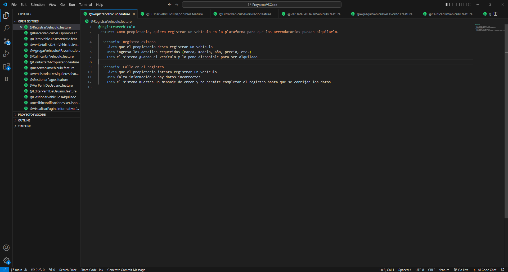

- US02:

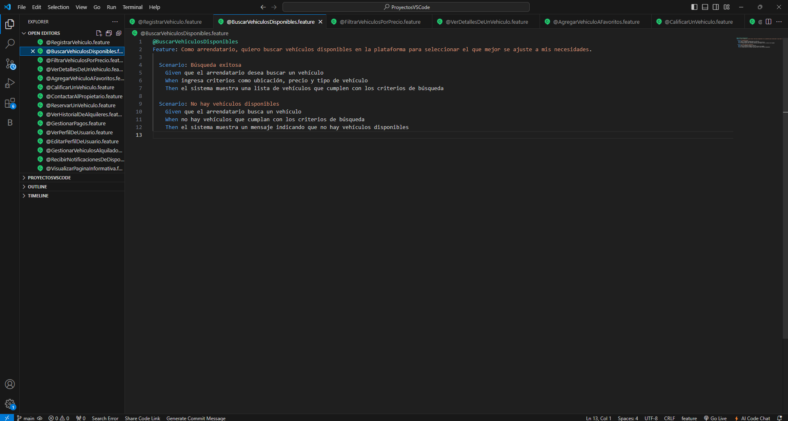

- US03:

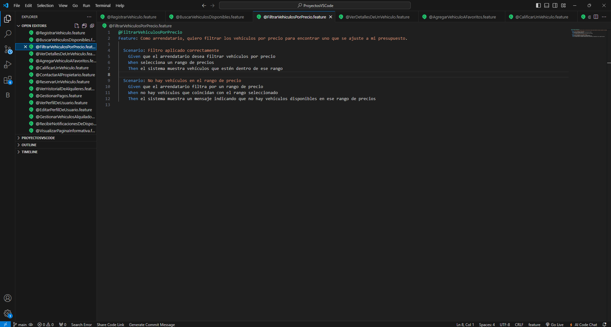

- US04:

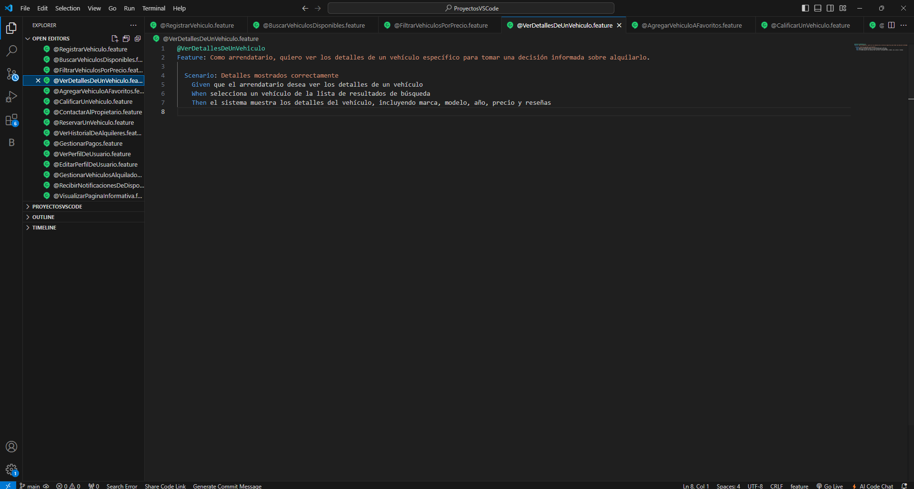

- US05:

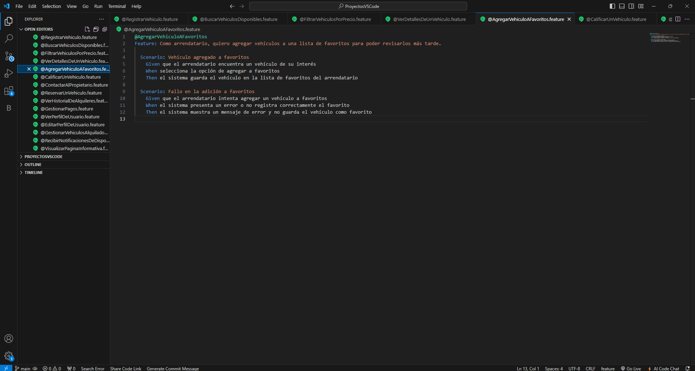

- US06:

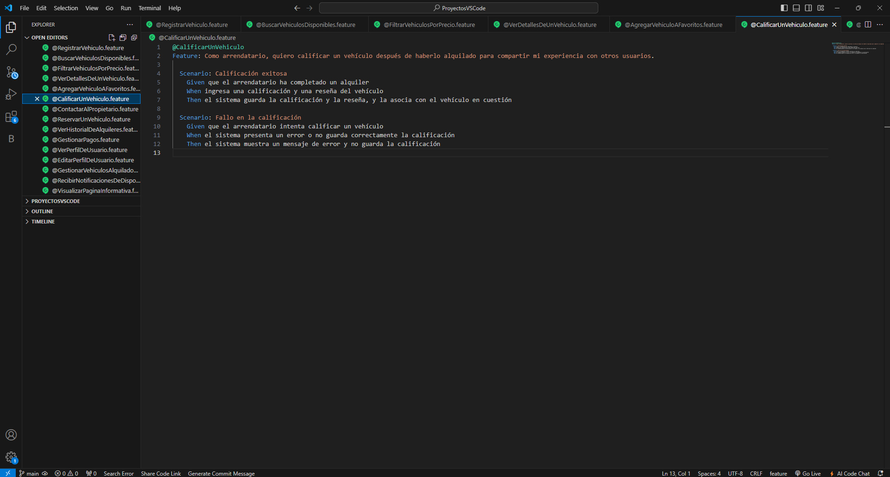

- US07:

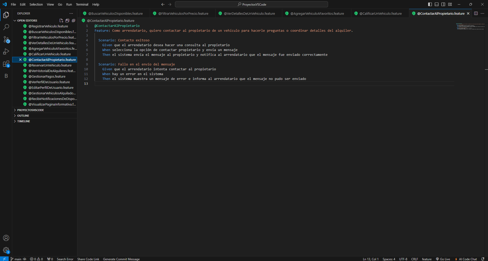

- US08:

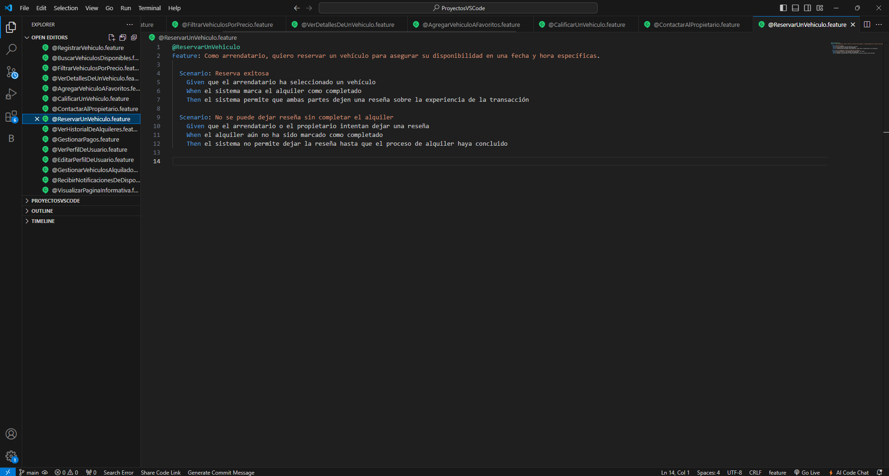

- US09:

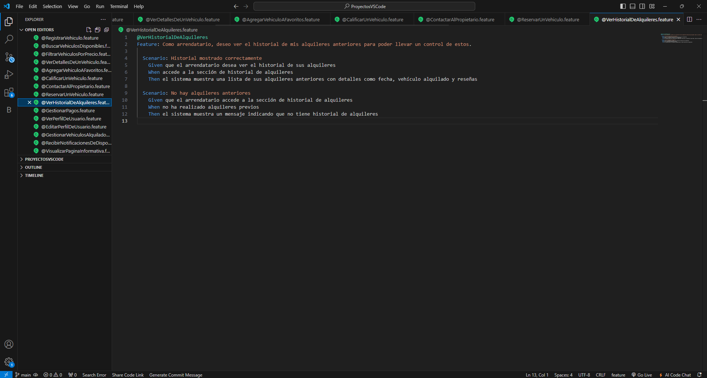

- US010:

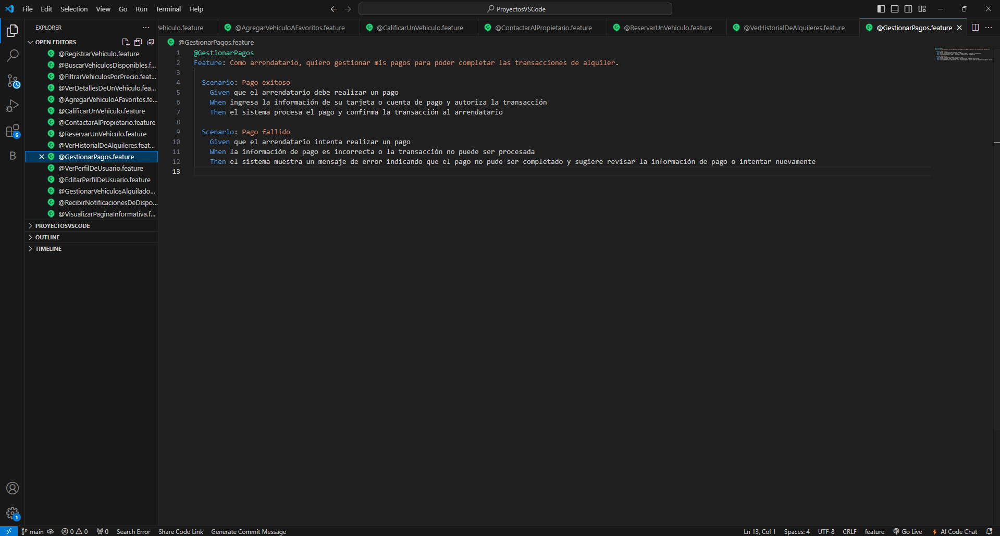

- US11:

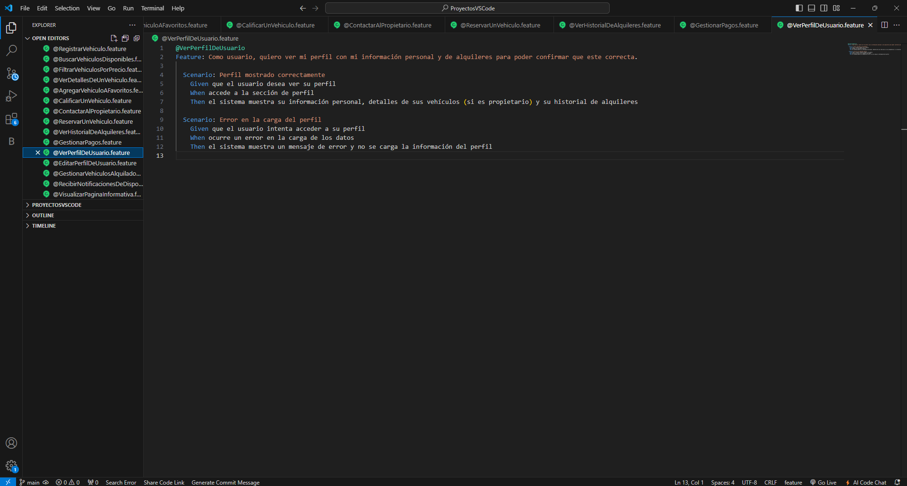

- US12:

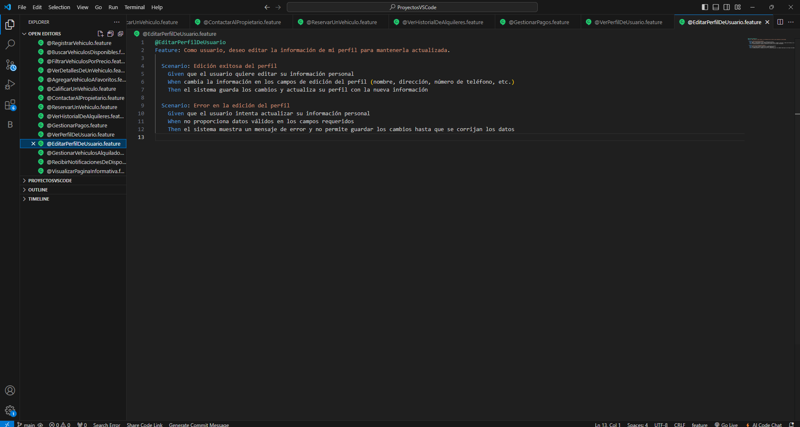

- US13:

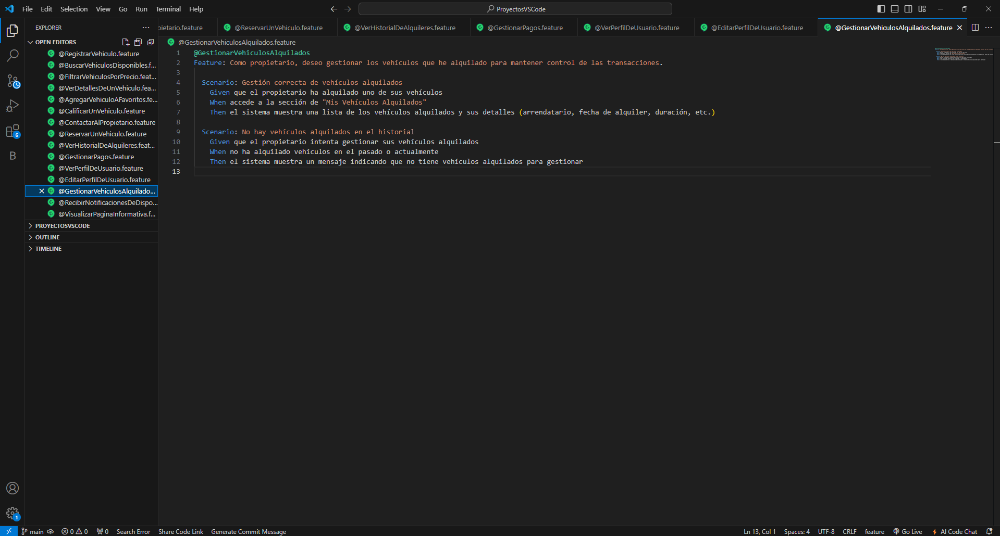

- US014:

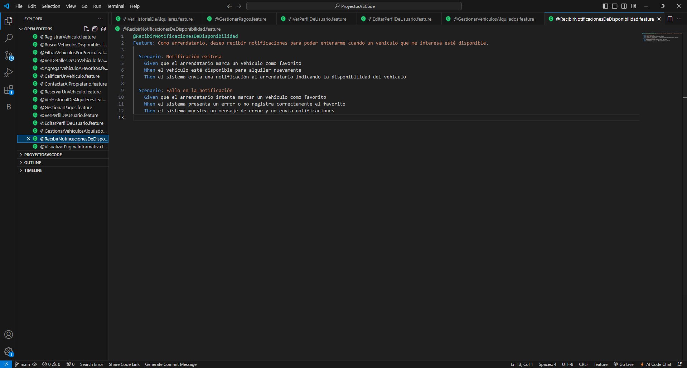

- US15:

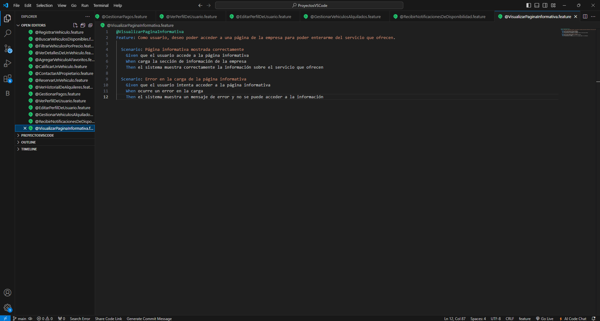
